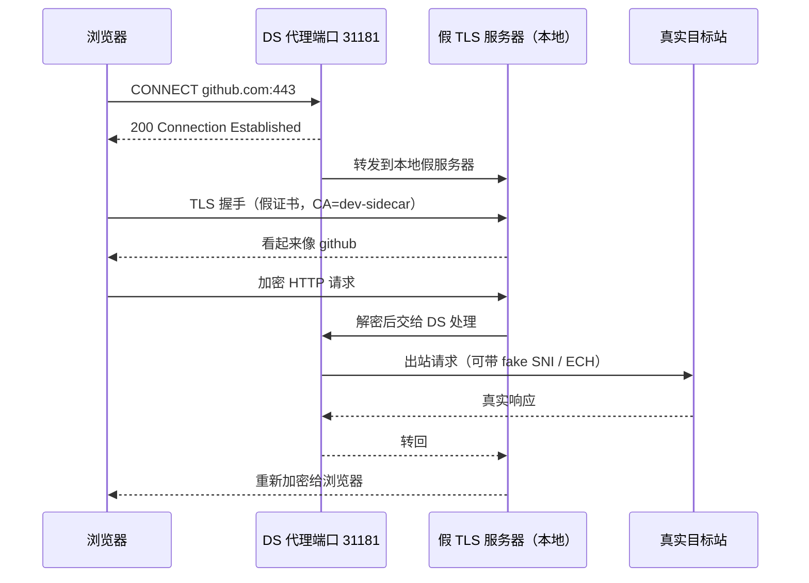

# ds-core

DevSidecar 内核仓库（**三位一体**之 core）：`core` + `mitmproxy`。

原 monorepo 拆分自 [docmirror/dev-sidecar](https://github.com/docmirror/dev-sidecar)（Issue #698 代号：三位一体）。

## 三位一体

| 仓库 | 职责 | 地址 |
|------|------|------|
| **ds-core**（本仓） | 代理内核 core + mitmproxy | https://github.com/Blue-Frontier/ds-core |
| **ds-cli** | 命令行 / SEA | https://github.com/Blue-Frontier/ds-cli |
| **ds-gui**（后续） | 桌面 GUI | https://github.com/Blue-Frontier/ds-gui |
| 历史主仓 | 迁移前 monorepo（只读参考） | https://github.com/docmirror/dev-sidecar |

用户配置目录与端口约定三端一致：`~/.dev-sidecar/`，HTTP **31180** / HTTPS **31181**。

## 包名

| 目录 | npm 包名（内部） |
|------|------------------|
| `core` | `@blue-frontier/dev-sidecar` |
| `mitmproxy` | `@blue-frontier/mitmproxy` |

包为 **private**，不在 npm 发布；消费方通过 **git submodule + pnpm workspace** 引用。

> 历史包 `@docmirror/*@<=1.7.3` 仍在 registry 上，与本仓无关，勿再用于 2.x。

## 依赖关系

```
@blue-frontier/mitmproxy ──workspace──► @blue-frontier/dev-sidecar
```

（`mitmproxy` 使用 core 的 logger / config / merge；`core` 使用 `mitmproxy` 的 `src/json`。）

## 架构速查：假 TLS 服务器 vs Fake SNI

两个「假」不是一回事，容易记混：

| | **假 TLS 服务器** | **Fake SNI** |
|--|------------------|--------------|
| 在哪一侧 | 浏览器 → DS（本地） | DS → 目标站（出站） |
| DS 的角色 | **TLS 服务端**（冒充目标站） | **TLS 客户端**（连目标站） |
| 为什么要假 | 让浏览器信任 DS，好解密看流量 | 让 GFW 看到 `baidu.com` 而不是真实域名 |
| 对应代码 | `mitmproxy/src/lib/proxy/tls/FakeServersCenter.js` | `rOptions.servername = 'baidu.com'` |



一句话：

- **假 TLS 服务器**：DS 冒充目标站，骗浏览器 → 属于**本机代理 / MITM**
- **Fake SNI**：DS 冒充在连别的站，骗 GFW → 属于**出站**

ECH 要替代的是后者（出站的 fake SNI），与假 TLS 服务器无关。

## 开发

```bash
pnpm install
pnpm test
pnpm lint
```

测试：

```bash
pnpm --filter @blue-frontier/dev-sidecar test
pnpm --filter @blue-frontier/mitmproxy test
```

## 被其他仓库引用

cli / gui 仓库将本仓放在 `vendor/ds-core`（git submodule）。本仓根目录直接是 `core/` 与 `mitmproxy/`（不再套 `packages/`）。外层把 `packages/core`、`packages/mitmproxy` 做成指向本仓的**相对**符号链接（`../vendor/ds-core/core`、`../vendor/ds-core/mitmproxy`），使外层保持历史的 `packages/*` 布局。workspace 声明：

```yaml
packages:
  - packages/*
  - '!**/test/**'
```

因 submodule 位于 `packages/` 之外，`packages/*` 天然不会收录它，无需 `!` 排除规则。

## License

MPL-2.0
